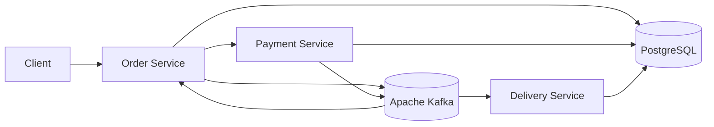

# 🚚 Spring Delivery Platform


**Spring Delivery Platform** is a microservices backend system that simulates an order delivery workflow.

Built with **Java, Spring Boot, Apache Kafka, PostgreSQL, and Docker**, the project demonstrates microservice architecture, asynchronous event-driven communication, shared contracts, and containerized infrastructure.

---

## 🧱 Architecture

The application is divided into several independent services, each responsible for its own part of the delivery workflow.



The platform combines synchronous service interaction with asynchronous event-driven communication through Apache Kafka.

---

## ⚙️ Tech Stack

| Category | Technologies |
|---|---|
| Language | Java 21 |
| Framework | Spring Boot |
| Web | Spring Web |
| Persistence | Spring Data JPA, Hibernate |
| Messaging | Apache Kafka |
| Database | PostgreSQL |
| Mapping | MapStruct |
| Boilerplate Reduction | Lombok |
| Infrastructure | Docker, Docker Compose |
| Build Tool | Gradle Kotlin DSL |

---

## 🧩 Services

### 📦 Order Service

Responsible for managing customer orders.

Main responsibilities:

- Creating new orders
- Managing order data
- Tracking order status
- Processing events related to payment and delivery
- Coordinating the order lifecycle

---

### 💳 Payment Service

Responsible for payment processing.

Main responsibilities:

- Receiving payment requests
- Processing order payments
- Managing payment state
- Participating in the order workflow
- Publishing or processing payment-related events

---

### 🚚 Delivery Service

Responsible for delivery management.

Main responsibilities:

- Processing delivery-related events
- Creating delivery records
- Assigning delivery information
- Managing delivery status
- Publishing delivery-related events

---

### 📚 Common Libraries

The `common-libs` module contains shared contracts used by multiple services.

It includes common:

- DTOs
- Event models
- Shared abstractions
- Communication contracts

This allows services to exchange consistent data while keeping shared models in one place.

---

## 📡 Event-Driven Communication

Apache Kafka is used for asynchronous communication between services.

A typical order workflow looks like this:

```text
1. Client creates an order
        ↓
2. Order Service processes the order
        ↓
3. Payment is processed
        ↓
4. Payment-related event is published
        ↓
5. Delivery Service reacts to the event
        ↓
6. Delivery is created or assigned
        ↓
7. Delivery-related event is published
        ↓
8. Order Service updates the final order state
```

This approach helps reduce direct coupling between services and demonstrates the principles of event-driven architecture.

---

## 📦 Project Structure

```text
Delivery_project
│
├── order-service/        # Order management
│
├── payment-service/      # Payment processing
│
├── delivery-service/     # Delivery management
│
├── common-libs/          # Shared DTOs and event contracts
│
├── docker-compose.yaml   # Local infrastructure
├── build.gradle.kts      # Root Gradle configuration
├── settings.gradle.kts   # Gradle project settings
└── README.md
```

---

## 🐳 Infrastructure

The local development environment is containerized with Docker Compose.

The infrastructure includes:

- **PostgreSQL** — relational database
- **Apache Kafka** — event broker
- Supporting Kafka infrastructure

Docker Compose makes it possible to start the required infrastructure with a single command.

---

## ▶️ Quick Start

### 1. Clone the repository

```bash
git clone https://github.com/Dolkisss/Delivery_project.git
cd Delivery_project
```

### 2. Start the infrastructure

```bash
docker compose up -d
```

### 3. Build the project

Linux / macOS:

```bash
./gradlew build
```

Windows:

```bash
gradlew.bat build
```

### 4. Run the services

Start each microservice separately:

```bash
./gradlew :order-service:bootRun
```

```bash
./gradlew :payment-service:bootRun
```

```bash
./gradlew :delivery-service:bootRun
```

---

## 👨‍💻 Author

**Dolkisss**

GitHub: [github.com/Dolkisss](https://github.com/Dolkisss)
